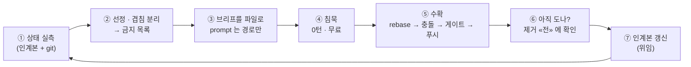
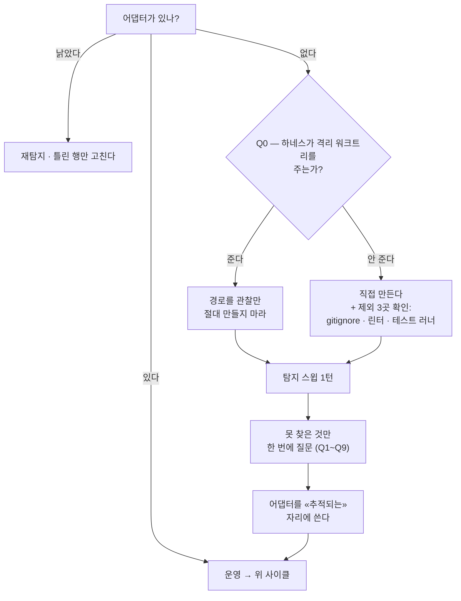

# parallel-worktree

<div align="right">
  <a href="README.ko.md"></a>
  <a href="README.md"></a>
  <a href="LICENSE"></a>
</div>

> 격리된 git 워크트리에서 코딩 서브에이전트를 병렬로 돌리고, 끝난 것을 차례로 «수확»해 상류에 올린다 —
> 작업을 잃지 않는 순서로.

Claude Code 스킬이다. 한 사람이 **오케스트레이터**가 되고, 각 트랙은 자기 워크트리에서 돌며,
오케스트레이터는 «투입 → 대기 → 수확 → 클리어» 만 한다. 어려운 것은 `git worktree` 명령이 아니라
**게이트가 전부 초록인 채로 이 파이프라인이 실패하는 지점들**, 그리고 **대기 시간을 잡일로 채우면
제곱으로 커지는 오케스트레이터 자신의 컨텍스트 비용**이다.

> 🔴 **정본은 영문 [`README.md`](README.md) 이고 스킬 본문도 영어다.** 이 문서는 한국어 미러이며,
> 내용이 갈리면 영문이 이긴다.

---

## 무엇을 푸는가

**1. 대기 시간이 비용의 전부다.** 오케스트레이터 세션의 컨텍스트 적분은 `∫ = c₀·n + g·n²/2` —
**턴 수 n 에 대해 제곱**이다. 워크트리가 도는 동안 잡일을 하는 것이 n 을 키운다.

<p align="center"></p>

같은 일 · 같은 날 · 같은 머신이다. 차이는 오로지 **에이전트가 도는 동안 오케스트레이터가 조용히
있었는가** 하나다.

<p align="center"></p>

**2. 초록 게이트는 여섯 가지 방식으로 거짓말한다.** 아래 전부 lint·타입·유닛·e2e 가 통과한 상태에서
관측됐다:

| # | 조용한 실패 | 판별 |
| --- | --- | --- |
| ① | 미커밋 트리에서 `git checkout <file>` | 변이가 아니라 그날 작업 전체가 사라지는데 `--stat` 은 «1 file changed» |
| ② | 쪼갠 커밋의 첫 커밋이 게이트를 깬다 | 내 트리엔 두 커밋이 다 얹혀 있고, **남의 base 가 되는 것은 커밋 하나**다 |
| ③ | 부재 단언이 채널 이동에 통과 | 없는 것은 전송이 옮겨가도 여전히 없다 |
| ④ | 변이가 통과한 이유가 그물이 아니라 **규약** | 규약이 라이브러리의 «기본 동작» 을 근거로 들면 그 버전 소스를 읽어라 |
| ⑤ | 조항이 있는데 재발했다 | «검사» 를 요구하는 규약은 도구가 되어야 한다 |
| ⑥ | 안전 검사를 우회하고 그 우회법을 적는다 | 게이트가 하나도 못 잡는다 — 오염된 것이 코드가 아니라 문서다 |

⑥ 은 이 파이프라인 고유의 것이다. **인계 문서로 세션을 이어가는 구조**라, 거기 적힌 우회법을 다음
세션이 «승인된 절차» 로 읽고 **라운드마다 증폭된다**.

**3. 게이트 동시 실행은 «안 돌린 것» 을 초록으로 위장한다.** 한 트랙의 유닛 전수를 다른 트랙의 e2e 와
동시에 돌리자 **515파일 중 381파일만** 실행됐다 — 134파일이 아예 안 돌았다. **부분 실행은 실패보다
나쁘다.** 통과와 구별되지 않기 때문이다.

### 사이클



사용자가 하는 말은 둘뿐이다: «다음 거 띄워» 와 «수확해줘». 인계본이 자동 로드 자리에 있으면 두 번째는
대개 «이어서» 한마디가 된다.

---

## 언제 **쓰지 마라**

이 파이프라인은 꽤 좁은 구간 밖에서는 **순손해**다. 아래가 «전부» 성립할 때만 써라:

| 조건 | 왜 |
| --- | --- |
| **작업 단위가 각 30분 이상** | 그 아래면 세션 고정 오버헤드(인계본 읽기 + 투입)가 이득을 먹는다 |
| **트랙이 실제로 안 겹친다** | 억지로 같은 파일에 두 트랙을 올리면 그 시간을 수확에서 다 잃는다 |
| **실제로 도는 게이트가 있다** | lint·타입·테스트가 없으면 «수확» 이 대조할 대상이 없고 병렬은 위험만 곱한다 |
| **머신이 감당한다** | 워크트리마다 의존성 트리·컴파일러·테스트 러너를 따로 갖는다 |

❌ **쓰지 마라**: 한 세션이면 끝나는 기능 하나 · 하면서 범위가 바뀌는 탐색성 작업 · 두 트랙이 같은
파일을 만져야 하는 일 · 자동 검사가 없는 레포 · «그냥 세션을 더 띄우면 되지» (같은 `.git` · 같은
`index.lock` · 게이트는 여전히 직렬이고, 거기에 «워킹 트리 소유권 혼란» 이 새로 생긴다 — RUNBOOK §11).

---

## 🔴 이 레포의 수치에 대하여

**여기 있는 모든 측정은 한 머신 · 한 레포 · 한 사람의 값이다**(React SPA · 2026-08). 효과의 «모양» 과
**«재는 법»** 을 보이려고 공개한 것이지, 가져다 쓰라고 적은 값이 아니다. *(sample, n=1)* 이 붙은 것은
다른 어디에서도 재현되지 않았다.

| 보게 될 수치 | 이렇게 다뤄라 |
| --- | --- |
| `c₀ 62K` · `g 947` · `∫ 68.0M` | **네 값을 재라** — 방법은 `RUNBOOK.md` §6-0 |
| 「동시 워크트리 2개」 | 출발점일 뿐. 네 상한은 네 머신의 속성이다 → 어댑터 Q9 |
| 「작업 단위 30~45분」 | 네 c₀·g·게이트 소요로 다시 풀어라 |
| 「게이트 8~15분」 | 재라. 그것이 네 수확 창을 정한다 |
| 「배치 동기화 41분 유실」 | «모양»(max − min)은 참이고 **크기는 네 것**이다 |

스킬은 **판정식과 측정법**을 갖는다. 프로젝트의 실제 값은 부트스트랩이 만들어 주는 **어댑터 파일**에
살고, 스킬 안에는 절대 들어가지 않는다.

---

## 설치

```bash
claude

/plugin marketplace add sh5623/guardrail
/plugin install parallel-worktree@guardrail
/reload-plugins
```

마켓 없이 이 레포에서 바로 설치해도 된다:

```bash
/plugin marketplace add sh5623/parallel-worktree
/plugin install parallel-worktree@parallel-worktree
/reload-plugins
```

훅·에이전트·의존성이 없다 — 스킬 1개와 참조 파일 3개뿐이다. `~/.claude/skills/` 나 프로젝트의
`.claude/skills/` 에 폴더째 복사해도 똑같이 동작한다.

---

## 첫 라운드

**«이 프로젝트에도 병렬 워크트리 세팅해줘»** 라고 말하면 스킬이 스스로 부트스트랩한다:



찾을 수 있는 것(게이트 명령·상류 브랜치·원격 종류·겹침 규칙·작업 단위 축)은 탐지하고, 나머지만 한 번에
모아 묻고, 어댑터 파일을 쓴다 — 프로젝트 값이 사는 유일한 자리다. 그 뒤로 브리프는 «이번 대상» 몇 줄로
줄어든다.

**첫 투입 전에 확인받는 3가지**: 동시 상한(2에서 시작) · 동기화 축(시간이냐 토큰이냐) · 작업 단위 축.

### 스태거냐 배치냐

| 우선하는 것 | 방식 | 대가 |
| --- | --- | --- |
| **시간** | 스태거 — 하나 끝나면 즉시 수확·재투입 | 항상 워크트리가 돌아 **세션을 비울 수 없다** → 컨텍스트가 n² 로 |
| **토큰** | 배치 — 둘 다 끝난 뒤 수확 → 비움 | 시간 `max − min` 유실 |
| **둘 다** | **작업 단위를 줄인다** | 세션 수 증가 → c₀ 를 더 자주 낸다(하한 있음) |

세 번째 행이 답이다. 작업 단위를 줄이면 편차와 `g` 항이 **함께** 줄어 트레이드오프가 아니다. 앞의 둘 중
무엇으로 물러설지는 스킬이 아니라 프로젝트가 정한다.

---

## 구성

```
skills/parallel-worktree/
  SKILL.md                      진입과 분기만 — 일부러 작게 유지한다
  references/RUNBOOK.md         수확 · 충돌 · 조용한 실패 6개 · 컨텍스트 예산 · 라이프사이클
  references/BRIEF-TEMPLATE.md  라운드 브리프 골격, 그리고 «반드시 들어가야 하는 4줄»
  references/ADAPTER-SPEC.md    프로젝트가 채워야 하는 값 · 탐지법 · Q0~Q9
```

이 분할은 의도적이다. `SKILL.md` 는 매 호출에 로드되므로 무거운 절차는 `references/` 에 두고 **그것이
필요한 턴에만** 읽는다. 투입만 하는 턴은 RUNBOOK 을 읽지 않는다.

## 기여

[`.github/CONTRIBUTING.md`](.github/CONTRIBUTING.md) 를 보라. 가장 값진 기여는 **두 번째 데이터
포인트**다 — 네 `c₀`·`g`·동시 상한·게이트 소요를 쟀다면 수치와 방법을 이슈로 올려 달라. 지금 여기 있는
것은 전부 n=1 이다.

## License

[MIT](LICENSE) © 2026 Seungho
