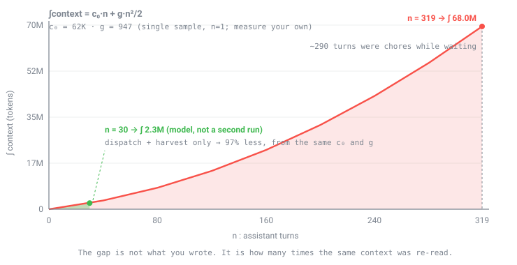
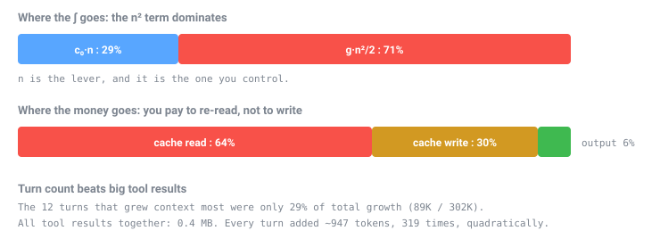
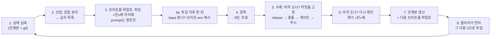
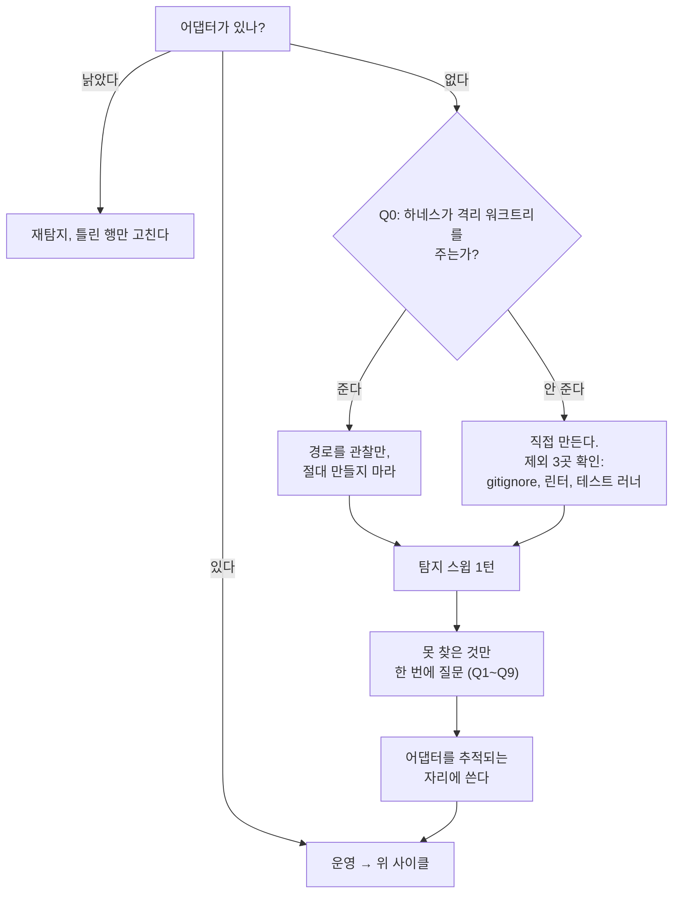

# parallel-worktree

<div align="right">
  <a href="README.ko.md"></a>
  <a href="README.md"></a>
  <a href="LICENSE"></a>
</div>

> 격리된 git 워크트리에서 코딩 서브에이전트를 병렬로 돌리고, 끝난 것을 하나씩 수확해 상류에 올린다.
> 작업을 잃지 않는 순서로.

Claude Code 스킬이다. 한 사람이 오케스트레이터가 되고, 트랙마다 자기 워크트리에서 돌며,
오케스트레이터는 투입하고 기다리고 수확하고 비운다.

정본은 영문 [`README.md`](README.md)이고 스킬 본문도 영어다. 내용이 갈리면 영문이 이긴다.

`git worktree` 명령은 쉬운 쪽이다. 실제로 값을 치르는 것은 두 가지다. 게이트가 전부 초록인 채로 이
파이프라인이 실패하는 지점들, 그리고 대기 시간을 잡일로 채우면 제곱으로 커지는 오케스트레이터 자신의
컨텍스트 비용.

## 대기 시간이 비용의 전부다

오케스트레이터 세션의 컨텍스트 적분은 `∫ = c₀·n + g·n²/2`, 턴 수 n에 대해 제곱이다. 워크트리가 도는
동안 잡일을 하는 것이 n을 키운다.

<p align="center"></p>

한 세션을 319턴에서 실측한 것이다. 30턴 지점은 두 번째 실행이 아니다. 그 세션의 비용 모델(실측한
c₀와 g)을, 투입과 수확에 쓰인 약 30턴에서 다시 계산한 값이다. 모델이 말하는 것은, 격차 전부가
에이전트가 도는 동안 오케스트레이터가 조용히 있었는가에 달렸다는 것이다. n=30으로 한 라운드를 실측한
사람은 아직 없다. [기여](#기여)를 보라.

<p align="center"></p>

과금 쪽이 더 뜻밖이었다. 내가 쓴 양에 돈을 내는 게 아니라, 같은 컨텍스트를 턴마다 다시 읽는 데 낸다.

## 왜 세션을 여러 개 띄우지 않고, 한 세션에 워크트리를 여러 개 두나

가장 먼저 나오는 질문이고, 답은 분명하다. **워크트리는 파일시스템과 git 인덱스를 격리한다. 세션을
하나 더 띄우는 것은 아무것도 격리하지 않는다.**

같은 레포에 Claude 세션을 하나 더 열어도 체크아웃 하나와 `.git` 하나를 그대로 공유한다. 얻는 것은
경합이고, 덤으로 전에 없던 부류의 버그가 생긴다.

| 나누고 싶었던 것 | 세션을 더 띄우면 실제로 벌어지는 일 |
| --- | --- |
| 워킹 트리 | 두 세션이 같은 체크아웃에 쓴다. 어느 쪽도 소유자가 아니다. |
| git 인덱스 | `index.lock` 충돌. 쓰는 쪽은 둘, 락은 하나. |
| 게이트 | 여전히 직렬이고, 더 나쁘다. 동시 실행이 515개 중 134개 테스트 파일을 건너뛰고 초록을 냈다. |
| 컨텍스트 비용 | 세션들이 정말 별개의 일을 할 때만 준다. 한 레포에 붙은 두 세션은 어차피 같은 상태를 다시 읽는다. |

표본 프로젝트의 실측 2건이 소유권 문제를 구체적으로 보여준다. 하나는, 다른 세션이 메인 체크아웃에 쓴
파일 4개를 내 워크트리 에이전트가 만든 것으로 지목한 일이다. 그 에이전트가 `git rev-parse
--show-toplevel`과 파일 부재로 반박하고 나서야 정정됐다. 내 워킹 트리에 낯선 파일이 있다고 해서 내
에이전트 것으로 단정하면 안 된다. 사람에게 먼저 물어라.

다른 하나는, 남의 미커밋 작업이 워킹 트리에 있어 `merge --ff-only`가 막히고 로컬 ref를 정렬할 수 없던
일이다. stash는 선택지가 아니었다. 남의 작업이기 때문이다. 해결은 상류 기준으로 임시 워크트리를 따서
거기서 커밋한 것이었다.

워크트리에는 이런 일이 없다. 각각이 자기 체크아웃, 자기 브랜치, 자기 인덱스를 가진 실제 디렉터리이고,
객체 저장소만 공유한다. 트리 하나에 쓰는 사람 하나, 수확하는 사람 하나. 게이트가 직렬인 것은 충돌해서가
아니라 그렇게 정했기 때문이다.

**세션 분리도 쓸모가 있다. 다만 용도가 다르다.** 오케스트레이터의 일을 여러 세션으로 나누면 n² 항이
줄고, 얼마나 주는지는 스킬에 표가 있다(표본에서 k=4일 때 약 40%). 단 세션이 메가세션이 되기 «전»에만
듣는다. 컨텍스트 상한에서 자동 요약을 반복할 만큼 커진 뒤에는 거의 못 구한다. 두 번째 표본에서 k=16이
3.8%였다. 그리고 세션 분리를 안전하게 만드는 규칙은 워크트리를 성립시키는 규칙과 같다. 커밋과 인계본은
`/clear`를 넘어 살아남고, 도는 에이전트는 죽는다는 것이다.

정리하면 병렬 «쓰기»는 워크트리, 오케스트레이터 «컨텍스트»는 세션 분리, 읽기 전용 작업(조사, 측정,
문서)은 아무 데서나.

## 초록 게이트가 거짓말하는 여섯 가지 방식

아래 전부 lint, 타입, 유닛, e2e가 통과한 상태에서 관측됐다.

| # | 조용한 실패 | 판별 |
| --- | --- | --- |
| 1 | 미커밋 트리에서 `git checkout <file>` | 변이가 아니라 그날 작업이 사라지는데 `--stat`은 "1 file changed"라고 한다 |
| 2 | 쪼갠 커밋의 첫 커밋이 게이트를 깬다 | 내 트리엔 두 커밋이 다 얹혀 있다. 남의 base가 되는 것은 커밋 하나다. |
| 3 | 부재 단언이 채널 이동에 통과 | 없는 것은 전송이 옮겨가도 여전히 없다 |
| 4 | 변이가 통과한 이유가 그물이 아니라 규약 | 규약이 라이브러리의 "기본 동작"을 근거로 들면 그 버전 소스를 읽어라 |
| 5 | 조항이 있는데 재발했다 | 검사를 요구하는 규약은 도구가 되어야 한다 |
| 6 | 안전 검사를 우회하고 그 우회법을 적는다 | 어떤 게이트도 못 잡는다. 오염된 것이 코드가 아니라 문서다. |

6번이 이 파이프라인 고유의 것이다. 인계 문서로 세션을 이어가는 구조라, 거기 적힌 우회법을 다음 세션이
승인된 절차로 읽고 라운드마다 증폭된다.

## 사이클



사용자가 하는 말은 둘뿐이다. "다음 거 띄워"와 "수확해줘". 인계본이 자동 로드 자리에 있으면 두 번째는
대개 "이어서" 한마디가 된다.

## 언제 쓰지 마라

꽤 좁은 구간 밖에서는 순손해다. 아래가 전부 성립할 때만 써라.

| 조건 | 왜 |
| --- | --- |
| 작업 단위가 각 30분 이상 | 그 아래면 세션 고정 오버헤드(인계본 읽기, 투입)가 이득을 먹는다 |
| 트랙이 실제로 안 겹친다 | 억지로 같은 파일에 두 트랙을 올리면 그 시간을 수확에서 다 잃는다 |
| 실제로 도는 게이트가 있다 | lint, 타입, 테스트가 없으면 수확이 대조할 대상이 없고 병렬은 위험만 곱한다 |
| 머신이 감당한다 | 워크트리마다 의존성 트리, 컴파일러, 테스트 러너를 따로 갖는다 |

한 세션이면 끝나는 기능 하나, 하면서 범위가 바뀌는 탐색성 작업, 두 트랙이 같은 파일을 만져야 하는 일,
자동 검사가 없는 레포에는 쓰지 마라. 세션을 더 띄우는 것의 대체재로도 쓰지 마라. 이유는 위에 있다.

## 이 레포의 수치에 대하여

여기 있는 모든 측정은 한 머신, 한 레포, 한 사람의 값이다(React SPA, 2026년 8월). 효과의 모양과 재는
법을 보이려고 공개한 것이지 가져다 쓰라고 적은 값이 아니다. `(sample, n=1)`이 붙은 것은 다른 어디에서도
재현되지 않았다.

| 보게 될 수치 | 이렇게 다뤄라 |
| --- | --- |
| `c₀ 62K`, `g 947`, `∫ 68.0M` | 네 값을 재라. 방법은 `RUNBOOK.md` 6-0. |
| "n=30에서 97% 절감" | 모델값이다. 같은 세션의 c₀와 g를 30턴에서 계산한 것이고, 두 번째 세션을 실측한 것이 아니다. |
| "동시 워크트리 2개" | 출발점일 뿐이다. 네 상한은 네 머신의 속성이라 어댑터(Q9)에 산다. |
| "작업 단위 30~45분" | 네 c₀, g, 게이트 소요로 다시 풀어라 |
| "게이트 8~15분" | 재라. 그것이 네 수확 창을 정한다. |
| "배치 동기화 41분 유실" | 모양(max 빼기 min)은 참이고 크기는 네 것이다 |

스킬은 판정식과 측정법을 갖는다. 프로젝트의 실제 값은 부트스트랩이 만들어 주는 어댑터 파일에 살고,
스킬 안에는 들어가지 않는다.

## 설치

```bash
claude

/plugin marketplace add sh5623/guardrail
/plugin install parallel-worktree@guardrail
/reload-plugins
```

마켓 없이 이 레포에서 바로 설치해도 된다.

```bash
/plugin marketplace add sh5623/parallel-worktree
/plugin install parallel-worktree@parallel-worktree
/reload-plugins
```

훅도 에이전트도 의존성도 없다. 스킬 1개와 참조 파일 3개뿐이다. `~/.claude/skills/`나 프로젝트의
`.claude/skills/`에 폴더째 복사해도 똑같이 동작한다.

## 첫 라운드

"이 프로젝트에도 병렬 워크트리 세팅해줘"라고 말하면 스킬이 스스로 부트스트랩한다.



찾을 수 있는 것은 탐지한다. 게이트 명령, 상류 브랜치, 원격 종류, 겹침 규칙, 작업 단위 축. 나머지만 한
번에 모아 묻고 어댑터 파일을 쓰는데, 그것이 프로젝트 값이 사는 유일한 자리가 된다. 그 뒤로 브리프는
이번 대상 몇 줄로 줄어든다.

첫 투입 전에 3가지를 확인받는다. 동시 상한(2에서 시작), 동기화 축(시간이냐 토큰이냐), 작업 단위 축.

### 스태거냐 배치냐

| 우선하는 것 | 방식 | 대가 |
| --- | --- | --- |
| 시간 | 스태거. 하나 끝나면 즉시 수확하고 재투입. | 항상 워크트리가 돌아 세션을 비울 수 없고, 컨텍스트가 n²로 큰다 |
| 토큰 | 배치. 둘 다 끝난 뒤 수확하고 비운다. | 시간 `max 빼기 min` 유실 |
| 둘 다 | 작업 단위를 줄인다 | 세션 수가 늘어 c₀를 더 자주 낸다. 하한이 있다. |

세 번째 행이 답이다. 작업 단위를 줄이면 편차와 `g` 항이 함께 줄기 때문이다. 트레이드오프가 아니다.
앞의 둘 중 무엇으로 물러설지는 스킬이 아니라 프로젝트가 정한다.

## 구성

```
skills/parallel-worktree/
  SKILL.md                      진입과 분기만. 일부러 작게 유지한다.
  references/RUNBOOK.md         수확, 충돌, 조용한 실패 6개, 컨텍스트 예산, 라이프사이클
  references/BRIEF-TEMPLATE.md  라운드 브리프 골격, 그리고 브리프에 반드시 들어가야 하는 4줄
  references/ADAPTER-SPEC.md    프로젝트가 채워야 하는 값, 탐지법, Q0~Q9
```

이 분할은 의도적이다. `SKILL.md`는 매 호출에 로드되므로 무거운 절차는 `references/`에 두고 그것이
필요한 턴에만 읽는다. 투입 턴이 여는 RUNBOOK은 «투입 준비와 투입 직후 점검» 한 절뿐이고, 수확 절차는
수확할 때 읽는다.

## 기여

[`.github/CONTRIBUTING.md`](.github/CONTRIBUTING.md)를 보라. 가장 쓸모 있는 기여는 두 번째 데이터
포인트다. 네 `c₀`, `g`, 동시 상한, 게이트 소요를 쟀다면 수치와 방법을 이슈로 올려 달라. 지금 여기 있는
것은 전부 n=1이다.

2026년 9월의 교차 레포 리뷰가 이 스킬에 대해 file:line이 붙은 결함 4건을 냈고, v0.4.0이 그 수정이다.
`SKILL.md` frontmatter가 유효한 YAML이 아니었다(description 안의 따옴표 없는 `trouble:` 때문에 스킬을
트리거하는 메타데이터가 통째로 빠진다). 게이트 생략 판별이 루트 설정 변경을 통과시켰다. 로그로 받아
grep 하는 한 줄이 게이트의 종료 코드를 버렸다. 브리프를 워크트리에 복사하는 시점이 에이전트가 이미 읽어
볼 수 있는 한 턴 «뒤»였다. 아직 도는지 확인하는 시점이, 에이전트의 트리를 다시 쓰는 rebase보다 늦었다.
전부 재현한 뒤에 받아들였다. 같은 리뷰가 규칙 둘을 좁히라고 했고 그렇게 했다. 침묵은 이제 모든 턴이
아니라 잡일과 폴링을 금지하고, «재현»의 위임은 허용하되 판정은 오케스트레이터에 남는다. GitHub Actions
워크플로가 매 푸시마다 모든 스킬의 frontmatter를 파싱하고 `claude plugin validate --strict`를 돌리므로,
첫 번째 결함은 다시 나갈 수 없다.

## License

[MIT](LICENSE) © 2026 Seungho
