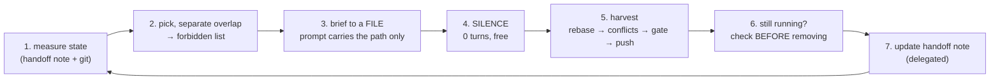
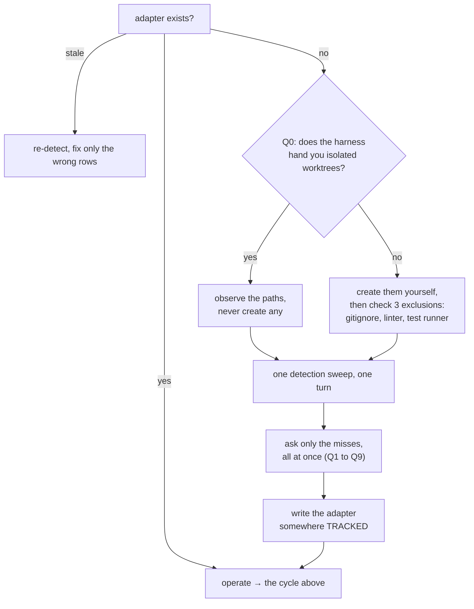

# parallel-worktree

<div align="right">
  <a href="README.ko.md"></a>
  <a href="README.md"></a>
  <a href="LICENSE"></a>
</div>

> Run coding subagents in parallel across isolated git worktrees, then harvest the finished ones
> upstream one at a time, in an order that does not lose work.

A Claude Code skill. One person acts as orchestrator. Each track runs in its own worktree. The
orchestrator dispatches, waits, harvests, and clears.

The `git worktree` commands are the easy part. What actually costs you is the set of places this
pipeline fails while every gate stays green, and the orchestrator's own context bill, which grows
quadratically if you fill the waiting time with chores.

## The waiting time is the whole cost

An orchestrator session's context integral is `∫ = c₀·n + g·n²/2`, quadratic in turn count. Doing
chores while worktrees run is what makes n large.

<p align="center"></p>

Same work, same day, same machine. The entire difference is whether the orchestrator stayed quiet
while the agents ran.

<p align="center"></p>

The billing split is the part that surprised me. You are not paying for what you wrote. You are
paying to re-read the same context, over and over, once per turn.

## Why one session and several worktrees, instead of several sessions

This is the question people ask first, and it has a concrete answer: **a worktree isolates the
filesystem and the git index. A second session does not isolate anything.**

Open a second Claude session on the same repo and you still share one checkout and one `.git`. What
you get is contention, plus a category of bug that did not exist before.

| What you hoped to split | What actually happens with a second session |
| --- | --- |
| The working tree | Both sessions write to the same checkout. Neither one owns it. |
| The git index | `index.lock` collisions. Two writers, one lock. |
| The gates | Still serial, and worse: concurrent runs skipped 134 of 515 test files and reported green |
| The context bill | Only if the sessions do genuinely separate work. Two sessions on one repo re-read the same state anyway. |

Two incidents from the sampled project make the ownership problem concrete. In the first, four files
another session had written to the main checkout were attributed to my worktree's agent, and the
mistake was only caught when that agent pushed back with `git rev-parse --show-toplevel` and the
files' absence. Never assume an unfamiliar file in your working tree came from your agent. Ask the
human first.

In the second, someone else's uncommitted work sat in the working tree and blocked `merge --ff-only`,
so the local ref could not be aligned. Stashing was not an option, because it was their work. The fix
was to cut a temporary worktree from upstream and commit from there.

A worktree has none of this. Each one is a real directory with its own checkout, its own branch, and
its own index, all backed by the same object store. One writer per tree. One harvester. Gates run
serially because you chose that, not because they collided.

**Splitting sessions is still useful, just for something else.** Splitting the *orchestrator's* work
across sessions cuts the n² term, and the skill has a table for how much (roughly 40% at k=4 in the
sample). But it only helps before a session becomes a mega-session. Once a session is large enough to
be auto-summarizing at the context ceiling, splitting recovers almost nothing: 3.8% at k=16 in the
second sample. And the rule that makes splitting safe is the same one that makes worktrees work,
which is that commits and a handoff note survive a `/clear` while a running agent does not.

So: worktrees for parallel *writing*, session splits for orchestrator *context*, and read-only work
(investigation, measurement, docs) anywhere you like.

## Green gates lie in six specific ways

Every one of these was observed with lint, types, unit tests, and e2e all passing.

| # | Silent failure | The tell |
| --- | --- | --- |
| 1 | `git checkout <file>` in a dirty tree | It deletes the day's work, not the mutation, and `--stat` still says "1 file changed" |
| 2 | First commit of a split series breaks the gate | Your tree has both commits applied. Someone else's base is one commit. |
| 3 | An absence assertion survives the channel moving | What is absent stays absent when the payload moves elsewhere |
| 4 | The mutation survived because the convention is wrong | The rule cites a library's "default behavior". Read that version's source. |
| 5 | The rule existed and it recurred anyway | A convention that demands a check has to become a tool |
| 6 | A safety check is routed around, and the workaround is written down | No gate catches it. What is contaminated is documents, not code. |

Number 6 is the one specific to this pipeline. Sessions are carried forward by handoff documents, so
a bypass recorded in one gets read by the next session as an approved procedure, and it amplifies
every round.

## The cycle



The user only ever says two things: "spin up the next one" and "harvest it". With the handoff note
somewhere that auto-loads, the second usually becomes "continue".

## When not to use this

Outside a fairly narrow band, this pipeline is a net loss. Reach for it only when all of these hold.

| Condition | Why it matters |
| --- | --- |
| Work units run 30+ minutes each | Below that, fixed session overhead (read handoff note, dispatch) eats the gain |
| Tracks genuinely do not overlap | Force two tracks onto the same files and you lose the parallelism back at harvest |
| You have a real gate | Without lint, types, or tests, "harvest" has nothing to verify against and parallelism just multiplies risk |
| The machine can take it | Each worktree carries its own dependency tree, compiler, and test runner |

Do not use it for a single feature small enough for one session, for exploratory work where the scope
changes as you go, for anything where two tracks must edit the same files, or in a repo with no
automated checks. And not as a substitute for opening more sessions, for the reasons above.

## About the numbers in this repo

Every measurement here comes from one machine, one repository, one operator, on a React SPA in
August 2026. They are published so you can see the shape of the effect and the method, never as
values to adopt. Anything marked `(sample, n=1)` has not been reproduced anywhere else.

| Number you will see | Treat it as |
| --- | --- |
| `c₀ 62K`, `g 947`, `∫ 68.0M` | Measure your own. The method is in `RUNBOOK.md` 6-0. |
| "2 concurrent worktrees" | A starting point. Your cap is a property of your machine, so it belongs in the adapter (Q9). |
| "30 to 45 minutes per work unit" | Re-derive it from your own c₀, g, and gate duration |
| "gates take 8 to 15 minutes" | Measure it. It sets your harvest window. |
| "41 minutes lost to batch sync" | The shape is real (max minus min). The magnitude is yours. |

The skill owns discriminators and measurement methods. Your project's actual values live in an
adapter file the skill generates during bootstrap, never in the skill itself.

## Install

```bash
claude

/plugin marketplace add sh5623/guardrail
/plugin install parallel-worktree@guardrail
/reload-plugins
```

Or install this repo directly, without the marketplace:

```bash
/plugin marketplace add sh5623/parallel-worktree
/plugin install parallel-worktree@parallel-worktree
/reload-plugins
```

No hooks, no agents, no dependencies. It is one skill and three reference files. Copying the folder
into `~/.claude/skills/` or a project's `.claude/skills/` works just as well.

## Your first round

Say "set up parallel worktrees on this project" and the skill bootstraps itself.



It detects what it can: gate commands, upstream branch, remote type, overlap rules, the work-unit
axis. Then it asks a single batched round of questions about the rest and writes an adapter file,
which becomes the one place your project's values live. After that, briefs shrink to a few lines
about the current target.

Before the first dispatch it will ask you to confirm three things: the concurrency cap (start at 2),
the synchronization axis (wall-clock or tokens), and the work-unit axis.

### Stagger or batch

| You optimize | Method | You pay |
| --- | --- | --- |
| Wall-clock | Stagger. Harvest and re-dispatch the moment one finishes. | A worktree is always running, so you can never clear, and context grows as n² |
| Tokens | Batch. Harvest once both finish, then clear. | `max - min` of wall-clock, lost |
| Both | Shrink the work unit | More sessions, so you pay c₀ more often. There is a floor. |

The third row is the answer, because a smaller work unit shrinks the spread and the `g` term at the
same time. It is not a trade-off. Which of the first two you fall back on is your project's call, not
the skill's.

## What is in here

```
skills/parallel-worktree/
  SKILL.md                      entry and branching only, kept small on purpose
  references/RUNBOOK.md         harvest, conflicts, the six silent failures, context budget, lifecycle
  references/BRIEF-TEMPLATE.md  the round-brief skeleton, and the four lines a brief must contain
  references/ADAPTER-SPEC.md    what your project must supply, how to detect it, Q0 to Q9
```

The split is deliberate. `SKILL.md` loads on every invocation, so the heavy procedures sit in
`references/` and get read only on the turn that needs them. A turn that merely dispatches never
opens RUNBOOK.

## Contributing

See [`.github/CONTRIBUTING.md`](.github/CONTRIBUTING.md). The most useful contribution is a second
data point. If you measure your own `c₀`, `g`, concurrency cap, or gate duration, open an issue with
the numbers and the method. Everything in here is currently n=1.

## License

[MIT](LICENSE) © 2026 Seungho
