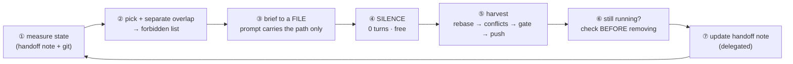

# parallel-worktree

<div align="right">
  <a href="README.ko.md"></a>
  <a href="README.md"></a>
  <a href="LICENSE"></a>
</div>

> Run coding subagents in parallel across isolated git worktrees, and harvest the finished ones
> upstream — one at a time, in an order that does not lose work.

A Claude Code skill. One person acts as **orchestrator**; each track runs in its own worktree; the
orchestrator dispatches, waits, harvests, and clears. The hard parts are not the `git worktree`
commands — they are **the places this pipeline fails while every gate stays green**, and **the
orchestrator's own context bill**, which grows quadratically if you fill the waiting time with chores.

---

## What it solves

**1. The waiting time is the whole cost.** An orchestrator session's context integral is
`∫ = c₀·n + g·n²/2` — quadratic in turn count. Doing chores while worktrees run is what makes n large.

<p align="center"></p>

Same work, same day, same machine — the difference is entirely **whether the orchestrator stayed
quiet while the agents ran**.

<p align="center"></p>

**2. Green gates lie in six specific ways.** Every one of these was observed with lint, types, unit,
and e2e all passing:

| # | Silent failure | The tell |
| --- | --- | --- |
| ① | `git checkout <file>` in a dirty tree | It deletes the day's work, not the mutation — and `--stat` says "1 file changed" |
| ② | First commit of a split series breaks the gate | Your tree has both commits; **someone else's base is one commit** |
| ③ | An absence assertion survives the channel moving | What is absent stays absent when the payload moves |
| ④ | The mutation survived because the **convention** is wrong | The rule cites a library's "default behavior" — read that version's source |
| ⑤ | The rule existed and it recurred anyway | A convention that demands a *check* must become a tool |
| ⑥ | A safety check is routed around, and the workaround is written down | Gates catch none of it — the contamination is in the documents |

⑥ is the one specific to this pipeline: sessions are carried forward by handoff documents, so a
bypass recorded in one is read by the next session as an approved procedure, and **amplifies every
round**.

**3. Concurrent gates disguise "never ran" as green.** Running one track's full unit suite alongside
another track's e2e executed **381 of 515 files** — 134 never ran. A partial run is worse than a
failure, because it is indistinguishable from a pass.

### The cycle



The user only ever says two things: *"spin up the next one"* and *"harvest it."* With the handoff
note somewhere that auto-loads, the second one usually becomes *"continue."*

---

## When **not** to use this

This pipeline is a net loss outside a fairly narrow band. Reach for it only when all of these hold:

| Condition | Why it matters |
| --- | --- |
| **Work units run 30+ minutes each** | Below that, fixed session overhead (read handoff note + dispatch) eats the gain |
| **Tracks genuinely do not overlap** | Force two tracks onto the same files and you lose the parallelism back at harvest |
| **You have a real gate** | Without lint/type/test, "harvest" has nothing to verify against and parallelism just multiplies risk |
| **The machine can take it** | Each worktree carries its own dependency tree, compiler, and test runner |

❌ **Do not use it for**: a single feature small enough for one session · exploratory work where the
scope changes as you go · anything where two tracks must edit the same files · a repo with no
automated checks · "I'll just open more sessions instead" (same `.git`, same `index.lock`, same
serial gates, plus a new class of working-tree ownership bugs — see RUNBOOK §11).

---

## 🔴 About the numbers in this repo

**Every measurement here comes from one machine, one repository, one operator** (a React SPA,
2026-08). They are published so you can see the *shape* of the effect and **the method**, never as
values to adopt. Anything marked *(sample, n=1)* has not been reproduced anywhere else.

| Number you will see | Treat it as |
| --- | --- |
| `c₀ 62K` · `g 947` · `∫ 68.0M` | **Measure your own** — the method is in `RUNBOOK.md` §6-0 |
| "2 concurrent worktrees" | A starting point. Your cap is a property of your machine → adapter, Q9 |
| "30–45 minutes per work unit" | Re-derive it from your own c₀, g, and gate duration |
| "gates take 8–15 minutes" | Measure it; it sets your harvest window |
| "41 minutes lost to batch sync" | The *shape* is real (max − min); the magnitude is yours |

The skill owns **discriminators and measurement methods**. Your project's actual values live in an
**adapter file** the skill generates during bootstrap — never in the skill itself.

---

## Install

```bash
claude

/plugin marketplace add sh5623/guardrail
/plugin install parallel-worktree@guardrail
/reload-plugins
```

Or install this repo directly, without the marketplace:

```bash
/plugin marketplace add sh5623/parallel-worktree
/plugin install parallel-worktree@parallel-worktree
/reload-plugins
```

No hooks, no agents, no dependencies — it is one skill and three reference files. Copying the folder
into `~/.claude/skills/` or a project's `.claude/skills/` works just as well.

---

## Your first round

Say **"set up parallel worktrees on this project"** and the skill bootstraps itself:


It detects what it can (gate commands, upstream branch, remote type, overlap rules, work-unit axis),
asks a single batched round of questions about the rest, and writes an adapter file — the one place
your project's values live. After that, briefs shrink to a few lines about the current target.

**Three things it will ask you to confirm before the first dispatch**: the concurrency cap (start at
2), the synchronization axis (wall-clock vs. tokens), and the work-unit axis.

### Stagger or batch

| You optimize | Method | You pay |
| --- | --- | --- |
| **Wall-clock** | Stagger — harvest and re-dispatch the moment one finishes | A worktree is always running, so you can never clear → context grows as n² |
| **Tokens** | Batch — harvest once both finish, then clear | `max − min` of wall-clock, lost |
| **Both** | **Shrink the work unit** | More sessions, so you pay c₀ more often (there is a floor) |

The third row is the answer: a smaller work unit shrinks the spread *and* the `g` term, so it is not
a trade-off. Which of the first two you fall back on is your project's call, not the skill's.

---

## What is in here

```
skills/parallel-worktree/
  SKILL.md                      entry and branching only — kept small on purpose
  references/RUNBOOK.md         harvest · conflicts · the six silent failures · context budget · lifecycle
  references/BRIEF-TEMPLATE.md  the round-brief skeleton, and the four lines a brief must contain
  references/ADAPTER-SPEC.md    what your project must supply, how to detect it, Q0–Q9
```

The split is deliberate: `SKILL.md` loads on every invocation, so the heavy procedures sit in
`references/` and are read only on the turn that needs them. A turn that merely dispatches never
reads RUNBOOK.

## Contributing

See [`.github/CONTRIBUTING.md`](.github/CONTRIBUTING.md). The most valuable contribution is
**a second data point** — if you measure your own `c₀`, `g`, concurrency cap, or gate duration, open
an issue with the numbers and the method. Everything in here is currently n=1.

## License

[MIT](LICENSE) © 2026 Seungho
